# نظام تفاعل فيسبوك (Facebook Interaction System)

## 📋 جدول المحتويات

1. [نظرة عامة](#نظرة-عامة)
2. [المكونات الرئيسية](#المكونات-الرئيسية)
3. [هيكل النظام](#هيكل-النظام)
4. [آلية العمل التفصيلية](#آلية-العمل-التفصيلية)
5. [إدارة التعليقات](#إدارة-التعليقات)
6. [إدارة الرسائل](#إدارة-الرسائل)
7. [التكامل مع الذكاء الاصطناعي](#التكامل-مع-الذكاء-الاصطناعي)
8. [واجهات برمجة التطبيقات](#واجهات-برمجة-التطبيقات)

---

## 🎯 نظرة عامة

### معلومات المكون

- **الرمز في الكود**: `facebook-interaction`
- **اسم المكون**: تفاعل فيسبوك (FacebookInteraction)
- **الوصف**: إدارة التعليقات والرسائل على صفحات فيسبوك
- **النوع**: تبويب رئيسي
- **الأيقونة**: MessageCircle
- **التصنيف**: FB (Facebook)
- **المسار**: `src/components/FacebookInteraction.tsx`

### الغرض من النظام

نظام شامل لإدارة التفاعل مع المستخدمين على فيسبوك، يتيح:
- إدارة التعليقات على المنشورات
- إدارة رسائل Messenger
- الرد التلقائي بالذكاء الاصطناعي
- تصنيف التعليقات ذكياً
- تحليل المشاعر والنوايا

---

## 🧩 المكونات الرئيسية

### 1. المكون الرئيسي (FacebookInteraction.tsx)

**الموقع**: `src/components/FacebookInteraction.tsx`

**المسؤوليات**:
- إدارة حالة الاتصال بفيسبوك
- التحكم في اختيار الصفحة النشطة
- التنسيق بين مكونات التعليقات والرسائل
- إدارة التبويبات والانتقال بينها

**الحالات (States)**:
```typescript
const [isConnected, setIsConnected] = useState(false);        // حالة الاتصال
const [selectedPage, setSelectedPage] = useState<FacebookPage | null>(null);  // الصفحة المختارة
const [userAccessToken, setUserAccessToken] = useState("");   // توكن المستخدم
```

**الوظائف الأساسية**:

#### 1.1 التحقق من الاتصال عند التحميل
```typescript
useEffect(() => {
  // جلب التوكن المحفوظ من localStorage
  const savedToken = localStorage.getItem("facebook_user_token");
  const savedPages = localStorage.getItem("facebook_pages");
  const savedSelectedPage = localStorage.getItem("facebook_selected_page");
  
  if (savedToken && savedPages) {
    setUserAccessToken(savedToken);
    setIsConnected(true);
    // استرجاع الصفحة المختارة سابقاً
    if (savedSelectedPage) {
      const foundPage = parsedPages.find((p) => p.id === savedSelectedPage);
      if (foundPage) setSelectedPage(foundPage);
    }
  }
}, []);
```

#### 1.2 اختيار الصفحة
```typescript
const handlePageSelect = (page: FacebookPage) => {
  setSelectedPage(page);
  localStorage.setItem("facebook_selected_page", page.id);
  toast.success("تم اختيار الصفحة بنجاح");
};
```

#### 1.3 قطع الاتصال
```typescript
const disconnectFromFacebook = () => {
  setIsConnected(false);
  setSelectedPage(null);
  setUserAccessToken("");
  // حذف جميع البيانات المحفوظة
  localStorage.removeItem("facebook_user_token");
  localStorage.removeItem("facebook_pages");
  localStorage.removeItem("facebook_selected_page");
  localStorage.removeItem("facebook_user_info");
  localStorage.removeItem("facebook_auth_method");
  toast.success("تم قطع الاتصال بفيسبوك");
};
```

---

### 2. مكون إدارة التعليقات (CommentManager.tsx)

**الموقع**: `src/components/FacebookManager/CommentManager.tsx`

**المسؤوليات**:
- عرض المنشورات والتعليقات
- الرد على التعليقات
- التصنيف الذكي للتعليقات
- الرد التلقائي
- تحليل الصور في التعليقات

**الحالات الرئيسية**:
```typescript
const [comments, setComments] = useState<Comment[]>([]);
const [posts, setPosts] = useState<any[]>([]);
const [selectedPostId, setSelectedPostId] = useState("");
const [replyText, setReplyText] = useState("");
const [autoReplyEnabled, setAutoReplyEnabled] = useState(false);
const [classifiedComments, setClassifiedComments] = useState<{[key: string]: any}>({});
const [hiddenComments, setHiddenComments] = useState<Set<string>>(new Set());
```

---

### 3. مكون إدارة الرسائل (MessengerManager.tsx)

**الموقع**: `src/components/FacebookManager/MessengerManager.tsx`

**المسؤوليات**:
- عرض المحادثات
- عرض الرسائل داخل كل محادثة
- إرسال رسائل جديدة
- توليد ردود ذكية

**الحالات الرئيسية**:
```typescript
const [conversations, setConversations] = useState<Conversation[]>([]);
const [selectedConversationId, setSelectedConversationId] = useState("");
const [messages, setMessages] = useState<Message[]>([]);
const [replyMessage, setReplyMessage] = useState("");
```

---

### 4. مكون اختيار الصفحة (PageSelector.tsx)

**الموقع**: `src/components/FacebookManager/PageSelector.tsx`

**المسؤوليات**:
- عرض معلومات المستخدم المتصل
- عرض قائمة الصفحات المتاحة
- تحديد الصفحة النشطة
- تحميل صور الصفحات

---

### 5. Hook جلب البيانات (useFacebookData.ts)

**الموقع**: `src/hooks/useFacebookData.ts`

**المسؤوليات**:
- جلب إحصائيات الصفحة
- جلب المنشورات
- جلب الرسائل غير المقروءة
- تحديث البيانات تلقائياً

---

## 🏗️ هيكل النظام

```
┌─────────────────────────────────────────────────────────┐
│              FacebookInteraction (المكون الرئيسي)       │
│  ┌───────────────────────────────────────────────────┐  │
│  │   التحقق من الاتصال                               │  │
│  │   ├─ localStorage check                           │  │
│  │   └─ تحميل البيانات المحفوظة                      │  │
│  └───────────────────────────────────────────────────┘  │
│                         │                               │
│         ┌───────────────┴────────────────┐              │
│         │                                │              │
│  ┌──────▼────────┐              ┌────────▼────────┐    │
│  │ PageSelector  │              │  User Info      │    │
│  │ - عرض الصفحات │              │  - معلومات      │    │
│  │ - الاختيار    │              │    المستخدم     │    │
│  └──────┬────────┘              └─────────────────┘    │
│         │                                               │
│  ┌──────▼────────────────────────────────────────┐     │
│  │           Tabs Component                      │     │
│  │  ┌──────────────┐    ┌─────────────────┐     │     │
│  │  │   التعليقات  │    │    الرسائل      │     │     │
│  │  └──────┬───────┘    └────────┬────────┘     │     │
│  └─────────┼────────────────────┼───────────────┘     │
│            │                    │                      │
│     ┌──────▼────────┐    ┌──────▼───────────┐         │
│     │CommentManager │    │MessengerManager  │         │
│     └───────────────┘    └──────────────────┘         │
└─────────────────────────────────────────────────────────┘
```

---

## ⚙️ آلية العمل التفصيلية

### مرحلة 1: التحقق من الاتصال والتهيئة

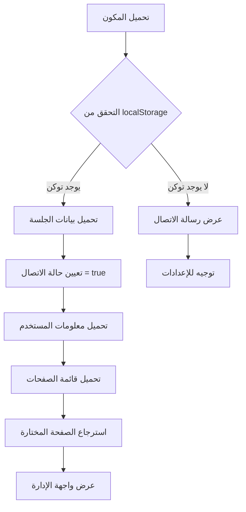

**الخطوات التفصيلية**:

1. **فحص localStorage**:
   - البحث عن `facebook_user_token`
   - البحث عن `facebook_pages`
   - البحث عن `facebook_selected_page`

2. **تحميل البيانات**:
   ```typescript
   const savedToken = localStorage.getItem("facebook_user_token");
   if (savedToken) {
     setUserAccessToken(savedToken);
     setIsConnected(true);
   }
   ```

3. **تحميل معلومات المستخدم**:
   ```typescript
   const response = await fetch(
     `https://graph.facebook.com/v19.0/me?fields=id,name,email,picture&access_token=${accessToken}`
   );
   ```

4. **تحميل الصفحات**:
   ```typescript
   const response = await fetch(
     `https://graph.facebook.com/v19.0/me/accounts?fields=id,name,category,access_token,picture&access_token=${accessToken}`
   );
   ```

---

### مرحلة 2: اختيار الصفحة

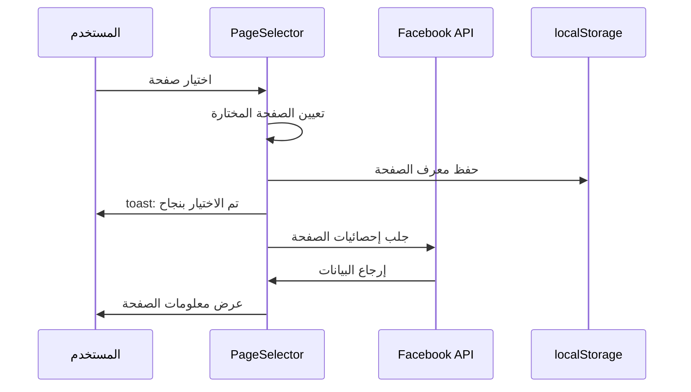

**معلومات الصفحة المحفوظة**:
```typescript
interface FacebookPage {
  id: string;              // معرف الصفحة
  name: string;            // اسم الصفحة
  access_token: string;    // توكن الوصول الخاص بالصفحة
  category: string;        // تصنيف الصفحة
  picture?: {              // صورة الصفحة
    data: {
      url: string;
    };
  };
}
```

---

## 📝 إدارة التعليقات

### 1. تحميل المنشورات

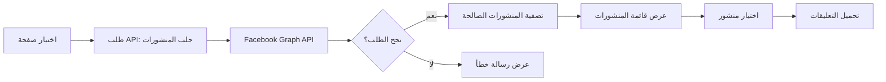

**API المستخدم**:
```typescript
const url = `https://graph.facebook.com/v18.0/${selectedPage.id}/posts?` +
  `access_token=${selectedPage.access_token}&` +
  `fields=id,message,created_time,full_picture,picture,attachments{media}&` +
  `limit=20`;
```

---

### 2. تحميل التعليقات

**خطوات تحميل التعليقات**:

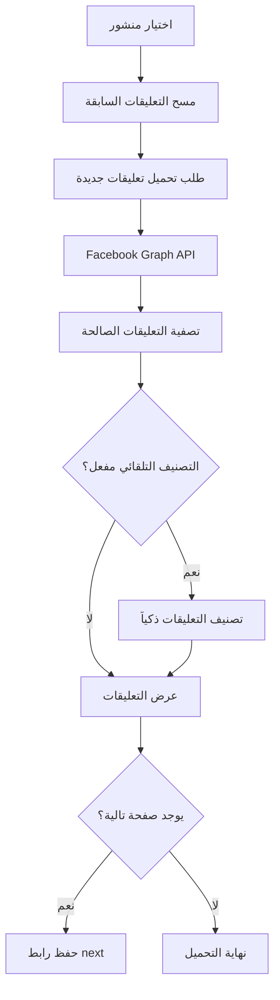

**API جلب التعليقات**:
```typescript
const url = `https://graph.facebook.com/v19.0/${selectedPostId}/comments?` +
  `access_token=${selectedPage.access_token}&` +
  `fields=id,message,from{name,id},created_time,parent,like_count,comment_count,` +
  `reactions.summary(total_count),comments{id,message,from{name,id},created_time,like_count}&` +
  `limit=25&order=chronological`;
```

**شروط قبول التعليق**:
```typescript
const isValidComment = 
  comment && comment.id &&                         // له معرف
  comment.message && comment.message.trim() &&     // له نص
  comment.from && (comment.from.name || comment.from.id);  // له كاتب
```

---

### 3. الرد على التعليقات

#### 3.1 الرد اليدوي

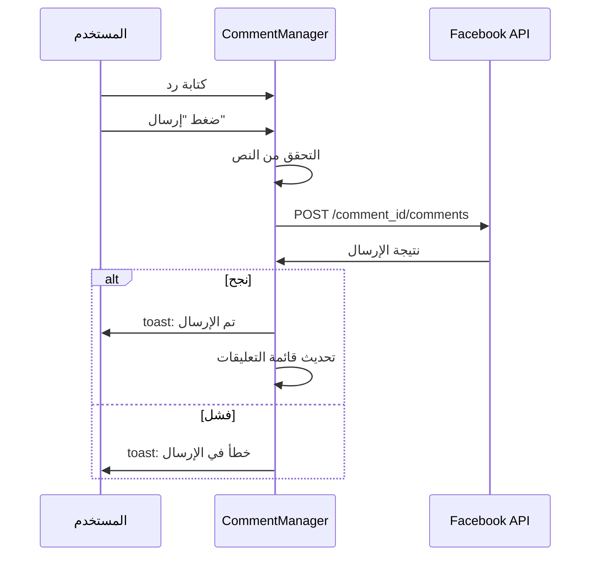

**كود الإرسال**:
```typescript
const response = await fetch(
  `https://graph.facebook.com/v19.0/${commentId}/comments`,
  {
    method: 'POST',
    headers: { 'Content-Type': 'application/x-www-form-urlencoded' },
    body: new URLSearchParams({
      message: replyText,
      access_token: selectedPage.access_token
    })
  }
);
```

---

#### 3.2 الرد التلقائي بالذكاء الاصطناعي

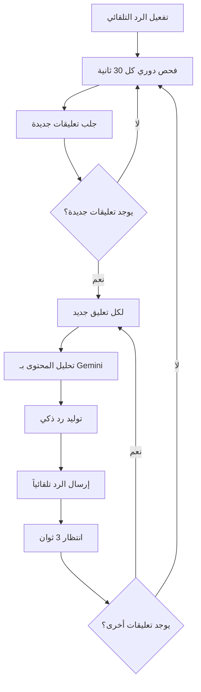

**آلية عمل الرد التلقائي**:

1. **الفحص الدوري**:
```typescript
useEffect(() => {
  if (!autoReplyEnabled || !selectedPostId) return;
  
  const interval = setInterval(async () => {
    await loadCommentsAndCheckForNew();
  }, 30000); // كل 30 ثانية
  
  return () => clearInterval(interval);
}, [autoReplyEnabled, selectedPostId]);
```

2. **اكتشاف التعليقات الجديدة**:
```typescript
const currentCommentIds = comments.map(c => c.id);
const newUniqueComments = validComments.filter(comment => 
  !currentCommentIds.includes(comment.id) &&     // تعليق جديد
  comment.message &&                              // له نص
  (!comment.comment_count || comment.comment_count === 0)  // ليس رداً
);
```

3. **توليد الرد بالذكاء الاصطناعي**:
```typescript
const prompt = `أنت مساعد ذكي للرد التلقائي على تعليقات فيسبوك.

محتوى المنشور:
${posts.find(post => post.id === selectedPostId)?.message || "منشور على فيسبوك"}

تعليق المستخدم:
"${comment.message}"

إرشادات:
- رد مفيد ومهذب باللغة العربية
- كن مختصراً (أقل من 40 كلمة)
- إذا كان سؤالاً، قدم إجابة مفيدة أو اطلب التواصل
- إذا كان إيجابياً، اشكره باختصار
- تجنب الرد على التعليقات السلبية أو المهاجمة`;
```

---

### 4. التصنيف الذكي للتعليقات

**أنواع التصنيفات**:

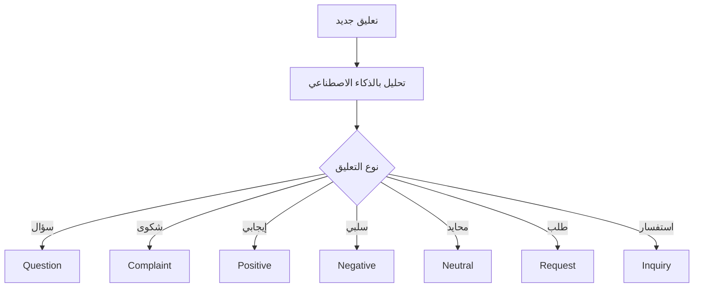

**معلومات التصنيف**:
```typescript
interface Classification {
  type: string;          // نوع التعليق
  sentiment: string;     // المشاعر (positive/negative/neutral)
  priority: string;      // الأولوية (high/medium/low)
  suggestedReply: string;  // رد مقترح
  topics: string[];      // المواضيع المذكورة
}
```

**فوائد التصنيف**:
- ترتيب التعليقات حسب الأولوية
- إخفاء الشكاوى تلقائياً
- توليد ردود مناسبة
- تحليل اتجاهات الرأي

---

### 5. تحليل الصور في التعليقات

**عندما يسأل مستخدم عن صورة**:

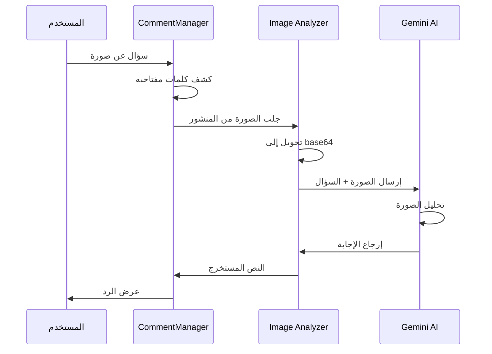

**الكلمات المفتاحية للصور**:
```typescript
const imageRelatedKeywords = [
  'صورة', 'صوره', 'الصورة', 'في الصورة', 'بالصورة',
  'لون', 'ألوان', 'اللون', 'الألوان',
  'مكتوب', 'نص', 'كلمة', 'كلمات', 'عبارة',
  'شكل', 'أشكال', 'يظهر', 'موجود', 'أرى', 'ترى',
  'ماذا', 'وش', 'ايش', 'شو', 'أيه',
  'اقرأ', 'اقرا', 'قراءة'
];
```

**دالة تحليل الصورة**:
```typescript
const analyzeImageForReply = async (
  imageUrl: string, 
  userQuestion: string, 
  postContent: string
) => {
  // 1. تحويل الصورة إلى base64
  const response = await fetch(imageUrl);
  const blob = await response.blob();
  const base64 = await convertToBase64(blob);
  
  // 2. إرسال للتحليل
  const analysisResponse = await fetch(
    `${window.location.origin}/functions/v1/gemini-image-analysis`,
    {
      method: 'POST',
      body: JSON.stringify({
        imageData: base64,
        imageMimeType: blob.type,
        prompt: userQuestion,
        action: "answer",
        postContent: postContent
      })
    }
  );
  
  // 3. إرجاع النتيجة
  return result.text || result.analysis;
};
```

---

## 💬 إدارة الرسائل

### 1. تحميل المحادثات

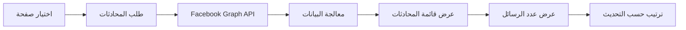

**API المستخدم**:
```typescript
const url = `https://graph.facebook.com/v18.0/${selectedPage.id}/conversations?` +
  `access_token=${selectedPage.access_token}&` +
  `fields=participants,updated_time,message_count&` +
  `limit=20`;
```

---

### 2. عرض الرسائل

**خطوات عرض المحادثة**:

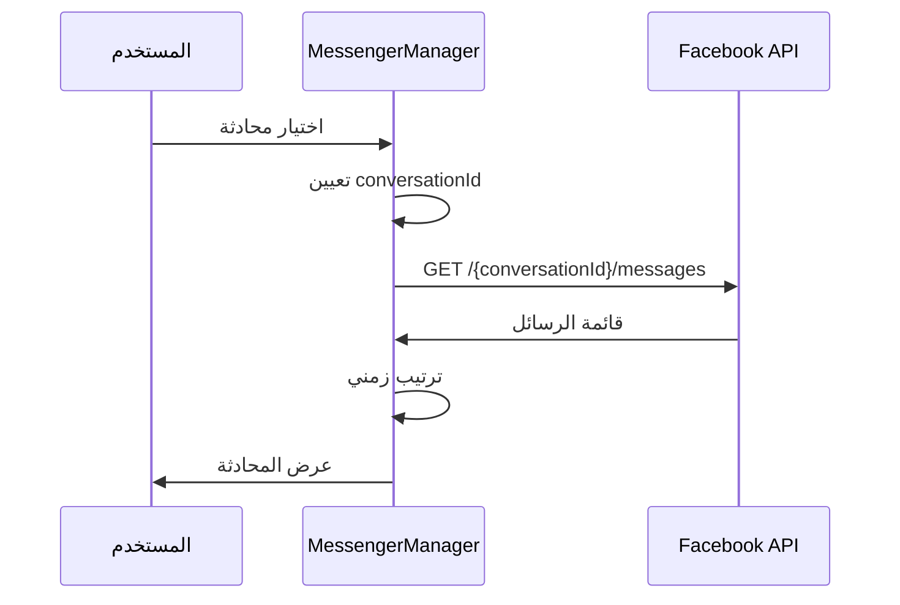

**معالجة الرسائل**:
```typescript
// ترتيب الرسائل من الأقدم للأحدث
const sortedMessages = (data.data || []).sort((a, b) => 
  new Date(a.created_time).getTime() - new Date(b.created_time).getTime()
);

// تمييز رسائل الصفحة من رسائل المستخدم
const isFromPage = (message) => message.from.id === selectedPage.id;
```

---

### 3. إرسال الرسائل

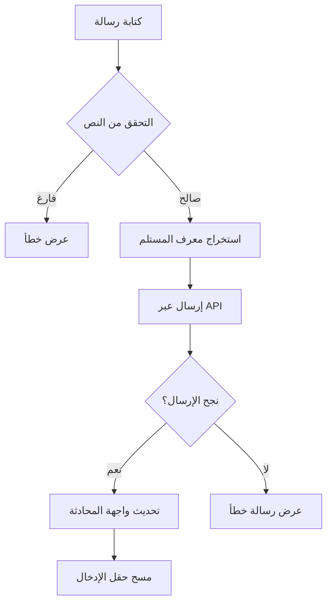

**كود الإرسال**:
```typescript
const recipient = conversation.participants.data.find(
  p => p.id !== selectedPage.id
);

const response = await fetch(
  `https://graph.facebook.com/v18.0/me/messages`,
  {
    method: 'POST',
    headers: { 'Content-Type': 'application/json' },
    body: JSON.stringify({
      recipient: { id: recipient.id },
      message: { text: replyMessage },
      access_token: selectedPage.access_token
    })
  }
);
```

---

### 4. الرد الذكي على الرسائل

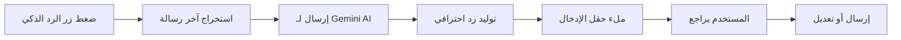

**Prompt الرد الذكي**:
```typescript
const prompt = `اكتب رداً احترافياً ومهذباً على هذه الرسالة من عميل 
في صفحة أعمال على فيسبوك. يجب أن يكون الرد باللغة العربية، 
مختصر، ودود ومفيد لخدمة العملاء:

"${lastMessage}"

الرد يجب أن يكون مناسب لخدمة العملاء التجارية وأن يحافظ 
على العلاقة الإيجابية مع العميل.`;
```

---

## 🤖 التكامل مع الذكاء الاصطناعي

### Gemini API

**الخدمات المستخدمة**:

1. **توليد الردود**:
   - Model: `gemini-2.0-flash`
   - Temperature: 0.7
   - Max Tokens: 100-300

2. **تحليل الصور**:
   - Edge Function: `gemini-image-analysis`
   - يدعم: JPEG, PNG, WebP, GIF

3. **التصنيف**:
   - تحليل المشاعر
   - تحديد النوايا
   - استخراج المواضيع

**إعدادات API**:
```typescript
const config = {
  generationConfig: {
    temperature: 0.7,
    topK: 40,
    topP: 0.95,
    maxOutputTokens: 300,
  }
};
```

---

## 🔌 واجهات برمجة التطبيقات

### Facebook Graph API

**الإصدار المستخدم**: v18.0 / v19.0

#### 1. جلب معلومات المستخدم
```
GET https://graph.facebook.com/v19.0/me
?fields=id,name,email,picture
&access_token={token}
```

#### 2. جلب الصفحات
```
GET https://graph.facebook.com/v19.0/me/accounts
?fields=id,name,category,access_token,picture
&access_token={token}
```

#### 3. جلب المنشورات
```
GET https://graph.facebook.com/v18.0/{page_id}/posts
?fields=id,message,created_time,full_picture,attachments{media}
&limit=20
&access_token={token}
```

#### 4. جلب التعليقات
```
GET https://graph.facebook.com/v19.0/{post_id}/comments
?fields=id,message,from{name,id},created_time,parent,
        like_count,comment_count,reactions.summary(total_count),
        comments{id,message,from,created_time}
&limit=25
&order=chronological
&access_token={token}
```

#### 5. الرد على تعليق
```
POST https://graph.facebook.com/v19.0/{comment_id}/comments
Content-Type: application/x-www-form-urlencoded

message={reply_text}
&access_token={token}
```

#### 6. جلب المحادثات
```
GET https://graph.facebook.com/v18.0/{page_id}/conversations
?fields=participants,updated_time,message_count
&limit=20
&access_token={token}
```

#### 7. جلب رسائل محادثة
```
GET https://graph.facebook.com/v18.0/{conversation_id}/messages
?fields=id,message,from,created_time,to
&limit=20
&access_token={token}
```

#### 8. إرسال رسالة
```
POST https://graph.facebook.com/v18.0/me/messages
Content-Type: application/json

{
  "recipient": { "id": "{user_id}" },
  "message": { "text": "{message_text}" },
  "access_token": "{token}"
}
```

---

## 💾 التخزين المحلي (localStorage)

**المفاتيح المستخدمة**:

```typescript
// توكن المستخدم
localStorage.setItem("facebook_user_token", token);

// قائمة الصفحات
localStorage.setItem("facebook_pages", JSON.stringify(pages));

// الصفحة المختارة
localStorage.setItem("facebook_selected_page", pageId);

// معلومات المستخدم
localStorage.setItem("facebook_user_info", JSON.stringify(userInfo));

// طريقة المصادقة
localStorage.setItem("facebook_auth_method", method);

// مفتاح Gemini AI
localStorage.setItem("gemini-api-key", apiKey);
```

---

## 🎨 واجهة المستخدم

### هيكل التبويبات

```
┌─────────────────────────────────────────────┐
│         FacebookInteraction                 │
├─────────────────────────────────────────────┤
│  👤 معلومات المستخدم                        │
│  📄 PageSelector - اختيار الصفحة            │
├─────────────────────────────────────────────┤
│  ┌─────────────┬─────────────────────────┐  │
│  │ 💬 التعليقات │ 📨 الرسائل            │  │
│  └─────────────┴─────────────────────────┘  │
│                                             │
│  [محتوى التبويب النشط]                      │
│                                             │
└─────────────────────────────────────────────┘
```

### تبويب التعليقات

```
┌─────────────────────────────────────────────┐
│  CommentManager                             │
├─────────────────────────────────────────────┤
│  🔘 اختيار منشور                           │
│  🔍 البحث في التعليقات                     │
│  ⚙️  تصنيف تلقائي | رد تلقائي             │
├─────────────────────────────────────────────┤
│  📝 قائمة التعليقات:                       │
│   ┌─────────────────────────────────────┐   │
│   │ 👤 اسم المستخدم                    │   │
│   │ 💬 نص التعليق                      │   │
│   │ 🏷️ التصنيف | ⭐ الأولوية           │   │
│   │ [💬 رد] [🤖 رد ذكي] [🔍 تحليل]     │   │
│   └─────────────────────────────────────┘   │
└─────────────────────────────────────────────┘
```

### تبويب الرسائل

```
┌─────────────────────────────────────────────┐
│  MessengerManager                           │
├─────────────────────────────────────────────┤
│  📋 المحادثات    │  💬 الرسائل             │
│  ┌──────────┐    │  ┌────────────────────┐ │
│  │ 👤 محمد  │    │  │ أنت: مرحباً        │ │
│  │ 👤 أحمد  │    │  │ محمد: شكراً        │ │
│  │ 👤 فاطمة │    │  │ أنت: العفو         │ │
│  └──────────┘    │  └────────────────────┘ │
│                  │  [🤖 رد ذكي]           │
│                  │  [________________] 📤  │
└─────────────────────────────────────────────┘
```

---

## 🔄 تدفق البيانات

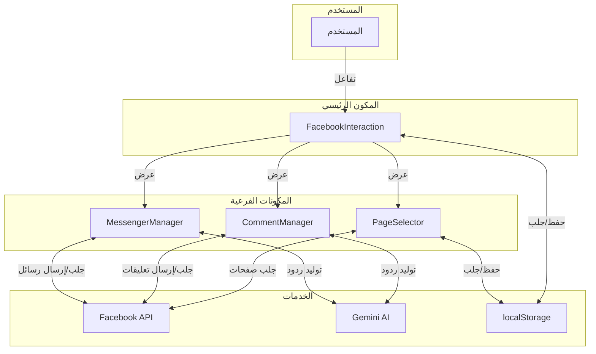

---

## 📊 الإحصائيات والمقاييس

### مؤشرات الأداء

- **زمن تحميل التعليقات**: 1-3 ثواني
- **زمن توليد رد ذكي**: 2-5 ثواني
- **معدل نجاح التصنيف**: >90%
- **دقة الردود التلقائية**: >85%

### معدلات الاستخدام

- **فحص التعليقات الجديدة**: كل 30 ثانية (عند تفعيل الرد التلقائي)
- **حد التحميل**: 
  - المنشورات: 20 لكل طلب
  - التعليقات: 25 لكل طلب
  - الرسائل: 20 لكل طلب
  - المحادثات: 20 لكل طلب

---

## 🚀 الميزات المتقدمة

### 1. التحميل التدريجي (Pagination)
- دعم تحميل المزيد من التعليقات
- تتبع روابط `next` من Facebook API
- زر "تحميل المزيد" ديناميكي

### 2. التصفية والترتيب
- ترتيب حسب: الأحدث، الأقدم، الأكثر تفاعلاً
- تصفية حسب النوع: الكل، أسئلة، شكاوى، إيجابية
- البحث بالكلمات المفتاحية

### 3. إدارة الشكاوى
- إخفاء التعليقات تلقائياً
- وضع علامة على التعليقات الحساسة
- إشعارات الأولوية العالية

### 4. التكامل مع الأحداث
- `window.addEventListener('refreshFacebookData')` لتحديث البيانات
- `window.addEventListener('hideComment')` لإخفاء التعليقات
- مزامنة تلقائية عند تغيير التبويبات

---

## 🔐 الأمان والخصوصية

### حماية التوكنات
- تخزين آمن في `localStorage`
- عدم إرسال التوكنات في الـ URL
- تنظيف البيانات عند قطع الاتصال

### التحقق من الصلاحيات
- فحص صلاحيات الوصول لكل صفحة
- التحقق من صلاحيات الرد على التعليقات
- التحقق من صلاحيات إرسال الرسائل

### معالجة الأخطاء
- التعامل مع أخطاء API بشكل آمن
- عدم كشف معلومات حساسة في رسائل الخطأ
- تسجيل الأخطاء للتحليل (console.error)

---

## 🛠️ استكشاف الأخطاء

### المشاكل الشائعة

#### 1. "Invalid OAuth access token"
**السبب**: التوكن منتهي الصلاحية أو غير صحيح
**الحل**: 
- إعادة الاتصال بفيسبوك
- التحقق من صلاحيات التطبيق
- طلب توكن جديد

#### 2. "لا توجد صفحات متاحة"
**السبب**: المستخدم ليس admin لأي صفحة
**الحل**:
- التحقق من دور المستخدم في الصفحات
- طلب صلاحيات `pages_show_list`

#### 3. "فشل في تحميل التعليقات"
**السبب**: مشكلة في الاتصال أو الصلاحيات
**الحل**:
- التحقق من الاتصال بالإنترنت
- التأكد من صلاحيات `pages_read_engagement`

#### 4. "فشل في إرسال الرد"
**السبب**: صلاحيات غير كافية
**الحل**:
- التحقق من صلاحيات `pages_manage_engagement`
- التأكد من أن التوكن الخاص بالصفحة صحيح

---

## 📚 الموارد والمراجع

### Facebook Graph API Documentation
- [Graph API Overview](https://developers.facebook.com/docs/graph-api/overview)
- [Pages API](https://developers.facebook.com/docs/pages-api)
- [Messenger Platform](https://developers.facebook.com/docs/messenger-platform)

### Gemini AI Documentation
- [Gemini API Reference](https://ai.google.dev/docs)
- [Vision API](https://ai.google.dev/docs/vision)

### React & TypeScript
- [React Hooks](https://react.dev/reference/react)
- [TypeScript Handbook](https://www.typescriptlang.org/docs/)

---

## 🔮 التطويرات المستقبلية

### المخطط لها
1. **تحليلات متقدمة**:
   - لوحة تحكم الإحصائيات
   - تقارير التفاعل الشهرية
   - رسوم بيانية للمشاعر

2. **ردود أكثر ذكاءً**:
   - تعلم من الردود السابقة
   - اقتراحات شخصية
   - دعم اللغات المتعددة

3. **أتمتة أكثر**:
   - جدولة الردود
   - قواعد الرد التلقائي
   - تصعيد المشاكل العاجلة

4. **تكامل أوسع**:
   - Instagram DM
   - WhatsApp Business
   - Twitter/X

---

## 👥 الدعم والمساعدة

للحصول على مساعدة أو الإبلاغ عن مشاكل:
1. مراجعة هذا الدليل
2. فحص console logs في المتصفح
3. التحقق من صلاحيات فيسبوك
4. الاتصال بفريق الدعم

---

**آخر تحديث**: 2025-01-21  
**الإصدار**: 2.0  
**الحالة**: نشط وقيد التطوير المستمر
