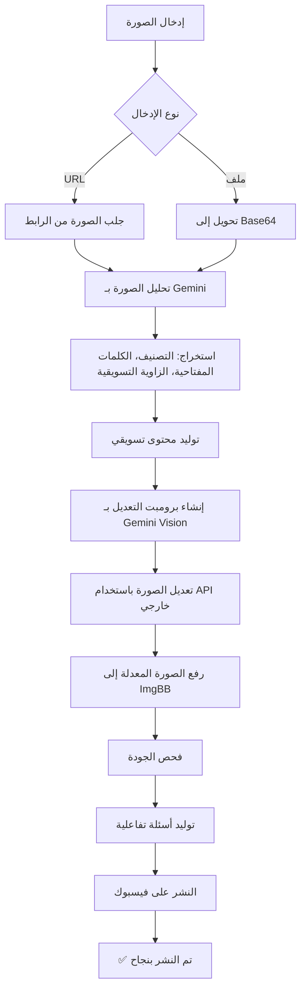
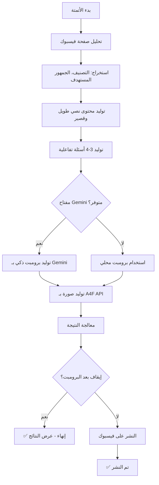

# 🚀 نظام النشر الآلي على فيسبوك (Automated Publishing System)

## 📋 جدول المحتويات

1. [نظرة عامة](#نظرة-عامة)
2. [المكونات الرئيسية](#المكونات-الرئيسية)
3. [آلية العمل](#آلية-العمل)
4. [APIs المستخدمة](#apis-المستخدمة)
5. [المراحل التفصيلية](#المراحل-التفصيلية)
6. [معالجة الأخطاء](#معالجة-الأخطاء)
7. [التقنيات المستخدمة](#التقنيات-المستخدمة)
8. [دليل الاستخدام](#دليل-الاستخدام)

---

## 🎯 نظرة عامة

نظام النشر الآلي هو نظام متكامل يستخدم الذكاء الاصطناعي لأتمتة عملية إنشاء ونشر المحتوى التسويقي على فيسبوك. يتكون النظام من مسارين رئيسيين:

### المسار الأول: النشر بالصور الموجودة
- تحليل صور موجودة (URL أو ملف محلي)
- تعديل الصور باستخدام AI
- توليد محتوى تسويقي
- النشر المباشر على فيسبوك

### المسار الثاني: توليد المحتوى من الصفر
- تحليل صفحة الفيسبوك
- توليد محتوى نصي احترافي
- إنشاء أسئلة تفاعلية
- توليد صور احترافية باستخدام AI
- النشر التلقائي

---

## 🔧 المكونات الرئيسية

### 1. الصفحات (Pages)
```
src/pages/AutomatedPublishingPage.tsx
```
- **الوظيفة**: واجهة المستخدم الرئيسية للنظام
- **المميزات**:
  - عرض نظرة عامة على ميزات النظام
  - التحقق من مفتاح Gemini API
  - زر اختبار Cron Jobs
  - تكامل مع مكون النشر الآلي

### 2. المكونات الأساسية (Core Components)

#### AutomatedImagePublisher
```
src/components/AutomatedImagePublisher.tsx
```
- **الوظيفة**: إدارة عملية تحليل وتعديل ونشر الصور
- **المراحل**:
  1. تحليل الصورة (Image Analysis)
  2. توليد المحتوى التسويقي (Content Generation)
  3. إنشاء برومبت التعديل (Edit Prompt)
  4. تعديل الصورة (Image Editing)
  5. فحص الجودة (Quality Check)
  6. توليد الأسئلة التفاعلية (Interactive Questions)
  7. النشر على فيسبوك (Facebook Publish)

#### AutomatedFacebookPublisher
```
src/components/AutomatedFacebookPublisher.tsx
```
- **الوظيفة**: واجهة شاملة للنشر الآلي
- **المميزات**:
  - دعم مفتاح API مخصص
  - خيارات متقدمة للتخصيص
  - معاينة المحتوى المولد
  - إدارة عملية النشر

### 3. الـ Hooks

#### useAutomationEngine
```
src/hooks/useAutomationEngine.ts
```
- **الوظيفة**: محرك الأتمتة الرئيسي
- **المراحل**:
  1. تحليل صفحة فيسبوك (facebook-analysis)
  2. توليد المحتوى (content-generation)
  3. توليد الأسئلة التفاعلية (interactive-questions)
  4. توليد برومبت الصورة (prompt-generation)
  5. توليد الصورة (image-generation)
  6. النشر الفوري (post-now)

#### useCreditsManager
```
src/hooks/useCreditsManager.ts
```
- **الوظيفة**: إدارة النقاط والاشتراكات
- **الميزات**:
  - فحص النقاط المتوفرة
  - استهلاك النقاط عند كل عملية
  - التحديث التلقائي للرصيد

---

## ⚙️ آلية العمل

### المسار 1: نظام تحليل وتعديل الصور



### المسار 2: نظام توليد المحتوى الكامل



---

## 🌐 APIs المستخدمة

### 1. Gemini AI API
```
https://generativelanguage.googleapis.com/v1beta/models/
```

**الاستخدامات**:
- **gemini-2.0-flash:generateContent**: توليد المحتوى النصي والبرومبتات
- **gemini-image-analysis**: تحليل الصور وفهم محتواها
- **gemini-marketing-content**: توليد محتوى تسويقي احترافي
- **gemini-image-edit-prompt**: إنشاء برومبتات تعديل الصور

**المعلمات الأساسية**:
```json
{
  "contents": [
    {
      "parts": [
        { "text": "النص المطلوب" },
        { "inline_data": { "mime_type": "image/jpeg", "data": "base64_data" } }
      ]
    }
  ]
}
```

### 2. Image Editor API (External)
```
https://image-editor-api.4kallaoui23.workers.dev/api/edit-image
```

**الوظيفة**: تعديل الصور باستخدام AI

**المعلمات**:
```json
{
  "imageUrl": "رابط الصورة الأصلية",
  "prompt": "وصف التعديل المطلوب",
  "style": "realistic"
}
```

**الاستجابة**:
```json
{
  "success": true,
  "message": "تم تعديل الصورة بنجاح",
  "imageData": "base64_encoded_data",
  "mimeType": "image/png"
}
```

**الأنماط المتاحة**:
- realistic
- cartoon
- anime
- oil-painting
- watercolor
- sketch
- digital-art
- vintage
- modern
- minimalist

### 3. ImgBB API
```
https://api.imgbb.com/1/upload
```

**الوظيفة**: رفع الصور المعدلة واستضافتها

**المعلمات**:
```javascript
const formData = new FormData();
formData.append('key', 'c9aeeb2c2e029f20a23564c192fd5764');
formData.append('image', base64_data);
```

**الاستجابة**:
```json
{
  "success": true,
  "data": {
    "url": "https://i.ibb.co/...",
    "display_url": "https://i.ibb.co/..."
  }
}
```

### 4. A4F Image Generation API
```
https://api.a4f.co/v1/images/generations
```

**الوظيفة**: توليد صور احترافية باستخدام AI

**المعلمات**:
```json
{
  "model": "provider-4/imagen-3",
  "prompt": "الوصف النصي للصورة",
  "n": 1,
  "size": "1024x1024"
}
```

**المفتاح**:
```
Bearer ddc-a4f-d18769825db54bb0a03e087f28dda67f
```

### 5. Facebook Graph API
```
https://graph.facebook.com/v19.0/{page_id}/photos
```

**الوظيفة**: نشر المحتوى والصور على صفحات فيسبوك

**المعلمات**:
```javascript
const formData = new FormData();
formData.append('message', post_content);
formData.append('url', image_url);
formData.append('access_token', page_access_token);
```

### 6. Supabase Edge Functions

**المتوفرة**:
- `gemini-image-analysis`: تحليل الصور
- `gemini-marketing-content`: توليد المحتوى التسويقي
- `gemini-image-edit-prompt`: إنشاء برومبتات التعديل
- `gemini-content-quality-check`: فحص جودة المحتوى

---

## 📊 المراحل التفصيلية

### المسار 1: AutomatedImagePublisher

#### المرحلة 1: تحليل الصورة (Image Analysis)
```typescript
{
  endpoint: 'gemini-image-analysis',
  input: {
    imageUrl: string,
    analysisType: 'marketing',
    language: 'arabic' | 'english'
  },
  output: {
    description: string,
    category: string,
    keywords: string[],
    marketingAngle: string,
    confidence: number
  }
}
```

**مثال على النتيجة**:
```json
{
  "description": "منتج غذائي صحي للمكملات الغذائية",
  "category": "صحة وتغذية",
  "keywords": ["مكملات", "صحة", "غذاء", "فيتامينات"],
  "marketingAngle": "منتج عالي الجودة للصحة العامة",
  "confidence": 92
}
```

#### المرحلة 2: توليد المحتوى التسويقي (Content Generation)
```typescript
{
  endpoint: 'gemini-marketing-content',
  input: {
    imageAnalysis: ImageAnalysis,
    targetAudience: string,
    marketingGoal: 'engagement' | 'sales' | 'awareness',
    language: string,
    customInstructions?: string
  },
  output: {
    content: string // المحتوى التسويقي الكامل
  }
}
```

**مثال على النتيجة**:
```text
🌟 اكتشف قوة الصحة الطبيعية! 💪

منتجنا الجديد من المكملات الغذائية عالية الجودة، 
مصمم خصيصاً للشباب المهتم بالصحة واللياقة...

📞 اطلب الآن واحصل على خصم خاص!
#صحة #مكملات_غذائية #حياة_صحية
```

#### المرحلة 3: إنشاء برومبت التعديل (Edit Prompt)
```typescript
{
  endpoint: 'gemini-image-edit-prompt',
  input: {
    imageAnalysis: ImageAnalysis,
    textContent: string,
    marketingGoal: string,
    language: string,
    imageData?: string // base64 للتحليل البصري
  },
  output: {
    editPrompt: string // وصف مفصل للتعديل
  }
}
```

**مثال على البرومبت**:
```text
Professional product photography of health supplement container, 
vibrant and modern design, clean white background, 
soft studio lighting, high contrast, 
add marketing text overlay in Arabic, 
emphasize product quality and freshness, 
use warm and inviting color palette
```

#### المرحلة 4: تعديل الصورة (Image Editing)
```typescript
{
  api: 'External Image Editor API',
  endpoint: 'https://image-editor-api.4kallaoui23.workers.dev/api/edit-image',
  input: {
    imageUrl: string,
    prompt: string,
    style: 'realistic'
  },
  output: {
    success: boolean,
    imageData: string, // base64
    mimeType: string
  }
}
```

**معالجة النتيجة**:
1. استلام الصورة المعدلة بصيغة base64
2. رفع الصورة إلى ImgBB
3. الحصول على URL دائم للصورة
4. حفظ النتيجة في الحالة

#### المرحلة 5: فحص الجودة (Quality Check)
```typescript
{
  endpoint: 'gemini-content-quality-check',
  input: {
    textContent: string,
    imageUrl: string,
    marketingGoal: string,
    targetAudience: string
  },
  output: {
    score: number, // 0-100
    feedback: string,
    suggestions: string[]
  }
}
```

**معايير الجودة**:
- ملاءمة المحتوى للجمهور: 25%
- جودة الصورة: 25%
- توافق النص والصورة: 25%
- القدرة على التفاعل: 25%

#### المرحلة 6: الأسئلة التفاعلية (Interactive Questions)
```typescript
{
  endpoint: 'gemini-interactive-questions',
  input: {
    textContent: string,
    imageAnalysis: ImageAnalysis,
    language: string
  },
  output: {
    questions: string[] // 3-5 أسئلة
  }
}
```

**مثال على الأسئلة**:
```javascript
[
  "ما هو أهم شيء تبحث عنه في المكملات الغذائية؟ 💭",
  "هل جربت منتجات مشابهة من قبل؟ شاركنا تجربتك! 🤔",
  "ما رأيك في المنتجات الطبيعية؟ 🌱"
]
```

#### المرحلة 7: النشر على فيسبوك (Facebook Publish)
```typescript
{
  api: 'Facebook Graph API',
  endpoint: 'https://graph.facebook.com/v19.0/{page_id}/photos',
  method: 'POST',
  body: {
    message: string, // المحتوى + الأسئلة
    url: string, // رابط الصورة المعدلة
    access_token: string
  },
  output: {
    id: string, // معرف المنشور
    post_id: string
  }
}
```

### المسار 2: useAutomationEngine

#### المرحلة 1: تحليل صفحة فيسبوك (Facebook Analysis)
```typescript
// تحليل محلي ذكي
{
  input: {
    topic: string,
    specialty: string
  },
  output: {
    category: string,
    targetAudience: string,
    contentStyle: string,
    keywords: string[],
    tone: string
  }
}
```

#### المرحلة 2: توليد المحتوى (Content Generation)
```typescript
// توليد محلي أو باستخدام Gemini
{
  output: {
    longText: string, // محتوى طويل مفصل
    shortText: string // ملخص قصير
  }
}
```

**نموذج المحتوى الطويل**:
```text
📢 [الموضوع]

نحن سعداء لتقديم خدماتنا المتميزة في مجال [التخصص]. 

🎯 ما نقدمه:
• خدمات متخصصة وعالية الجودة
• فريق خبير ومتميز
• حلول مبتكرة ومطورة
• خدمة عملاء ممتازة على مدار الساعة

📞 للاستفسار والحجز، تواصل معنا الآن!

#الموضوع #التخصص #خدمات_متميزة
```

#### المرحلة 3: الأسئلة التفاعلية (Interactive Questions)
```typescript
{
  output: string[] // 3-4 أسئلة ذكية
}
```

#### المرحلة 4: توليد البرومبت (Prompt Generation)
```typescript
// استخدام Gemini (إذا كان المفتاح متوفراً) أو برومبت محلي
{
  geminiPrompt: `Generate a creative and detailed English image prompt 
                 for professional ${imageStyle} image about "${topic}" 
                 in the ${specialty} field...`,
  localFallback: `Professional ${imageStyle} image about ${topic} 
                  in ${specialty} field, high quality...`
}
```

#### المرحلة 5: توليد الصورة (Image Generation)
```typescript
{
  api: 'A4F Image Generation API',
  model: 'provider-4/imagen-3',
  size: '1024x1024',
  output: {
    url: string,
    prompt: string
  }
}
```

#### المرحلة 6: النشر الفوري (Post Now)
```typescript
{
  api: 'Facebook Graph API',
  endpoint: '{page_id}/photos',
  message: shortText + '\n\n' + longText,
  image_url: generatedImageUrl
}
```

---

## 🛡️ معالجة الأخطاء

### نظام المحاولات المتعددة (Retry Logic)

```typescript
// مثال من edit prompt generation
const maxAttempts = 3;
for (let attempt = 1; attempt <= maxAttempts; attempt++) {
  try {
    const result = await apiCall();
    if (result.success) break;
  } catch (error) {
    if (attempt < maxAttempts) {
      await delay(2000); // انتظار 2 ثانية
      continue;
    }
    throw error;
  }
}
```

### الخيارات الاحتياطية (Fallback Options)

#### 1. تعديل الصور
```typescript
try {
  // محاولة استخدام API خارجي
  editedImage = await externalImageEdit();
} catch (error) {
  // الرجوع للصورة الأصلية
  editedImage = originalImage;
  toast.warning('تم استخدام الصورة الأصلية');
}
```

#### 2. توليد البرومبت
```typescript
if (customGeminiApiKey) {
  try {
    return await geminiGeneratePrompt();
  } catch (error) {
    // الرجوع للبرومبت المحلي
    return generateLocalPrompt();
  }
} else {
  return generateLocalPrompt();
}
```

### إدارة النقاط (Credits Management)

```typescript
// قبل كل عملية مكلفة
const { canConsume } = useCreditsManager();
const checkResult = await canConsume(costInCredits);

if (!checkResult.canConsume) {
  toast.error(`رصيدك غير كافٍ. المتوفر: ${checkResult.available}`);
  return;
}

// بعد العملية الناجحة
await consumeCredits(costInCredits, 'image_analysis');
```

### رسائل الحالة المفصلة

```typescript
updateStep(stepId, {
  status: 'running',
  details: 'جاري معالجة الطلب...'
});

// عند النجاح
updateStep(stepId, {
  status: 'completed',
  details: '✅ تم بنجاح في 3.2 ثانية'
});

// عند الفشل
updateStep(stepId, {
  status: 'error',
  error: '❌ فشل: سبب محدد'
});
```

---

## 🔧 التقنيات المستخدمة

### Frontend
- **React 18**: إطار العمل الأساسي
- **TypeScript**: لغة البرمجة
- **Tailwind CSS**: تنسيق الواجهة
- **Shadcn/ui**: مكتبة المكونات
- **Lucide React**: الأيقونات
- **Sonner**: الإشعارات (Toast)

### State Management
- **React Context**: إدارة الحالة العامة
  - `FacebookContext`: حالة فيسبوك
  - `GeneratedContentContext`: المحتوى المولد
- **React Hooks**: Custom hooks للعمليات المعقدة

### Backend Integration
- **Supabase Client**: التواصل مع Backend
- **Edge Functions**: معالجة جانب الخادم
- **Supabase Database**: تخزين البيانات
  - `automation_subscriptions`: إدارة الاشتراكات
  - `user_credits`: تتبع النقاط

### APIs & Services
1. **Google Gemini AI**: الذكاء الاصطناعي الرئيسي
2. **External Image Editor**: تعديل الصور
3. **ImgBB**: استضافة الصور
4. **A4F**: توليد الصور
5. **Facebook Graph API**: النشر على فيسبوك

---

## 📖 دليل الاستخدام

### الإعداد الأولي

#### 1. تكوين Gemini API
```typescript
// في واجهة المستخدم
<GeminiApiKeyPrompt 
  onApiKeySet={saveApiKey}
  currentApiKey={apiKey}
/>
```

#### 2. ربط صفحة فيسبوك
```typescript
// يجب أن تكون صفحة فيسبوك مرتبطة
const { selectedPage } = useFacebook();
if (!selectedPage) {
  toast.error('يرجى اختيار صفحة فيسبوك');
}
```

### استخدام المسار الأول (تعديل الصور)

```typescript
// 1. اختيار نوع الإدخال
<Select value={inputType} onValueChange={setInputType}>
  <SelectItem value="url">رابط URL</SelectItem>
  <SelectItem value="file">ملف محلي</SelectItem>
</Select>

// 2. إدخال الصورة
{inputType === 'url' && (
  <Input 
    value={imageInput}
    onChange={(e) => setImageInput(e.target.value)}
    placeholder="https://example.com/image.jpg"
  />
)}

// 3. تحديد الإعدادات
<Input 
  value={targetAudience}
  placeholder="الشباب المهتم بالصحة"
/>
<Select value={marketingGoal}>
  <SelectItem value="engagement">التفاعل</SelectItem>
  <SelectItem value="sales">المبيعات</SelectItem>
</Select>

// 4. بدء العملية
<Button onClick={processImageAutomation}>
  بدء الأتمتة
</Button>
```

### استخدام المسار الثاني (توليد كامل)

```typescript
// 1. تكوين الأتمتة
const config: AutomationConfig = {
  topic: 'خدمات التسويق',
  specialty: 'تسويق رقمي',
  contentType: 'promotional',
  language: 'arabic',
  imageStyle: 'modern',
  imageSource: 'ai-generated',
  customGeminiApiKey: 'YOUR_KEY',
  stopAfterPromptGeneration: false
};

// 2. تشغيل الأتمتة
const { runAutomation, steps, isRunning } = useAutomationEngine();
await runAutomation(config);

// 3. مراقبة التقدم
{steps.map(step => (
  <StepIndicator
    key={step.id}
    title={step.title}
    status={step.status}
    duration={step.duration}
  />
))}
```

### مراقبة استهلاك النقاط

```typescript
const { checkCredits, consumeCredits } = useCreditsManager();

// قبل العملية
const creditCheck = await checkCredits();
console.log('الرصيد المتوفر:', creditCheck.available);

// بعد العملية
await consumeCredits(2, 'image_generation');
```

---

## 📈 الأداء والتحسينات

### متوسط الأوقات
- تحليل الصورة: 2-3 ثوانٍ
- توليد المحتوى: 3-5 ثوانٍ
- تعديل الصورة: 8-12 ثانية
- فحص الجودة: 2-3 ثوانٍ
- النشر على فيسبوك: 1-2 ثانية
- **الإجمالي**: 16-25 ثانية

### استهلاك النقاط
- تحليل الصورة: 2 نقطة
- توليد المحتوى: 1 نقطة
- تعديل الصورة: 3 نقاط
- فحص الجودة: 1 نقطة
- توليد الأسئلة: 1 نقطة
- توليد الصورة (A4F): 5 نقاط
- **الإجمالي للمسار الأول**: 8 نقاط
- **الإجمالي للمسار الثاني**: 8-13 نقطة

### التحسينات المستقبلية
1. ✅ تخزين مؤقت للتحليلات المتشابهة
2. ✅ معالجة دفعات متعددة
3. ✅ جدولة المنشورات
4. ✅ تحليل أداء المنشورات
5. ✅ توصيات ذكية للتحسين

---

## 🐛 المشاكل الشائعة والحلول

### 1. فشل تعديل الصورة
**المشكلة**: API الخارجي لا يستجيب
**الحل**: النظام يرجع تلقائياً للصورة الأصلية

### 2. نفاد النقاط
**المشكلة**: `insufficient_credits`
**الحل**: 
```typescript
if (error.code === 'insufficient_credits') {
  toast.error('رصيدك غير كافٍ. يرجى شحن النقاط');
  navigate('/credits');
}
```

### 3. فشل رفع الصورة إلى ImgBB
**المشكلة**: خطأ في الشبكة أو حجم الصورة
**الحل**: إعادة المحاولة مع ضغط الصورة

### 4. خطأ في مفتاح Gemini API
**المشكلة**: مفتاح غير صالح أو منتهي
**الحل**:
```typescript
if (error.message.includes('API_KEY')) {
  toast.error('مفتاح Gemini API غير صالح');
  // إعادة توجيه لإدخال المفتاح
}
```

---

## 🔐 الأمان والخصوصية

### حماية المفاتيح
- جميع مفاتيح API محفوظة في `localStorage` مشفرة
- لا يتم إرسال المفاتيح للـ backend إلا عند الضرورة
- استخدام HTTPS لجميع الطلبات

### التحقق من الصلاحيات
```typescript
// التحقق من صلاحيات فيسبوك
if (!selectedPage.access_token) {
  throw new Error('لا توجد صلاحيات للنشر');
}

// التحقق من ملكية الصفحة
const pageInfo = await verifyPageOwnership(selectedPage.id);
```

### حدود الاستخدام
- حد أقصى لحجم الصورة: 4 ميجابايت
- حد أقصى لطول النص: 5000 حرف
- حد أقصى للطلبات: 100 طلب/ساعة

---

## 📞 الدعم والمساعدة

### لمزيد من المعلومات
- الوثائق الكاملة: `/docs`
- أمثلة الكود: `/examples`
- API Reference: `/api-docs`

### الإبلاغ عن المشاكل
```typescript
// تسجيل الأخطاء التفصيلي
console.error('Error details:', {
  step: currentStep,
  error: error.message,
  stack: error.stack,
  timestamp: new Date().toISOString()
});
```

---

## 📝 ملاحظات التطوير

### البنية المعمارية
```
src/
├── pages/
│   └── AutomatedPublishingPage.tsx      # الصفحة الرئيسية
├── components/
│   ├── AutomatedImagePublisher.tsx      # مسار تعديل الصور
│   ├── AutomatedFacebookPublisher.tsx   # مسار التوليد الكامل
│   ├── AutomationSetupGuide.tsx         # دليل الإعداد
│   └── AutomationStepResults.tsx        # عرض النتائج
├── hooks/
│   ├── useAutomationEngine.ts           # محرك الأتمتة
│   ├── useCreditsManager.ts             # إدارة النقاط
│   └── useGeminiApiKey.ts               # إدارة مفاتيح API
└── utils/
    ├── geminiApiManager.ts              # إدارة طلبات Gemini
    └── pixabayService.ts                # خدمة الصور
```

### المساهمة
نرحب بالمساهمات! يرجى اتباع هذه الإرشادات:
1. Fork المشروع
2. إنشاء branch جديد (`feature/amazing-feature`)
3. Commit التغييرات
4. Push إلى Branch
5. فتح Pull Request

---

**آخر تحديث**: 2025-10-12  
**الإصدار**: 2.0.0  
**المطور**: فريق التطوير
